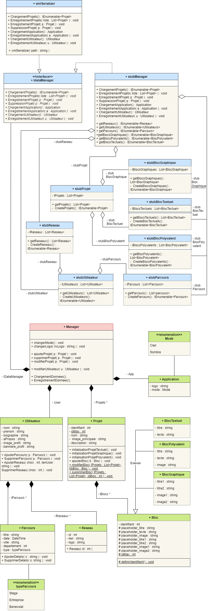
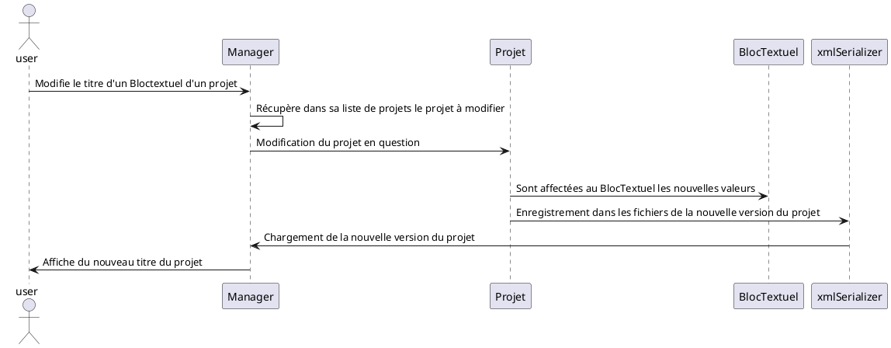
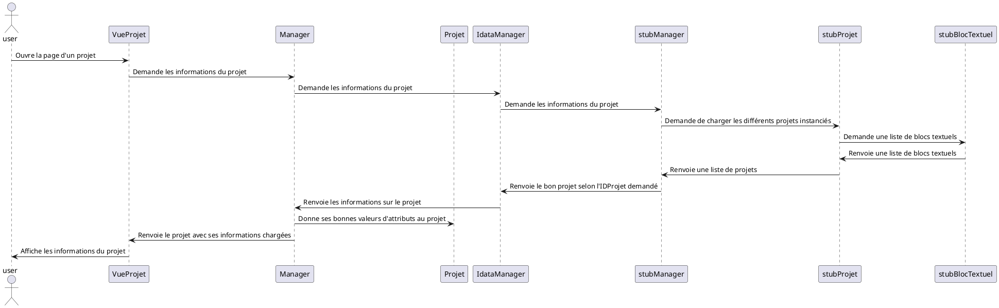
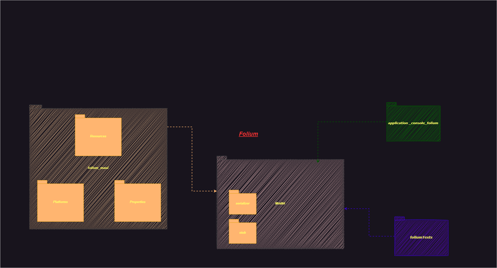
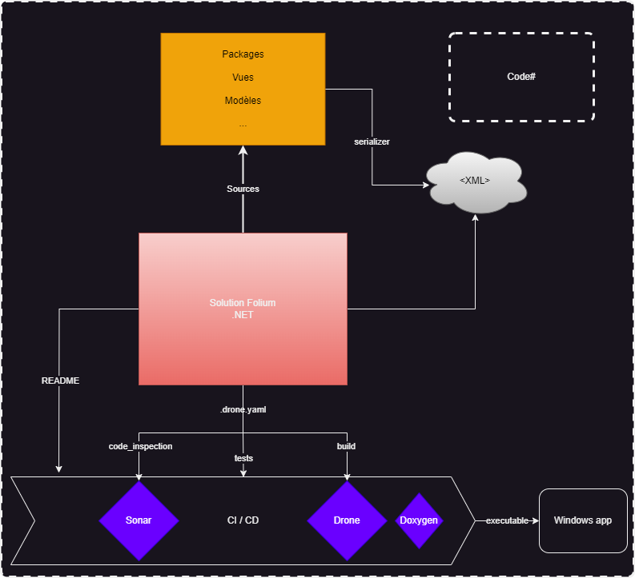

# Folium
## **Pour ceux découvrant le projet depuis GitHub**
---
Ce projet a été réalisé dans le cadre de ma première année en BUT Informatique. Ayant obtenu la bonne note de 16.5/20, je laisse l'intégralité du repo à disposition des curieux. 

Le projet n'est pas entièrement terminé, faute de temps. Il manque donc la mise en place d'un déploiement (le seul moyen de faire tourner l'application est de cloner en local et de lancer avec visual studio), une amélioration de certaines vues de l'application et l'implémentation de certaines fonctionnalités. 

Pour autant, ce projet s'est avéré particulièrement complet, enrichissant et suffisamment travaillé pour mériter sa place ici. 

Toutes les informations sur le but de l'application et sa structure sont à retrouver dans ce README et au niveau du Wiki.

Bonne découverte ! 

---

## **Introduction**

Folium est un projet visant à créer une application de gestion de Portofolio. 
Le but de l'application est ainsi de pouvoir exposer ses projets, tant techniques qu'artistiques, le tout avec un aspect graphique épuré et agréable à l'oeil. 

Ce projet est réalisé dans le cadre de la SAE 2.01 : Développement d'une application.

Dans la suite de ce fichier, vous pouvez retrouver toute la documentation permettant de comprendre en détail l'architecture, la structure et la logique misent en oeuvre dans le cadre de la conception de Folium. 

---
## Diagramme de classes

### **Présentation**
Un diagramme de classes UML (Unified Modeling Language) est un outil graphique utilisé pour représenter les différentes classes d'un système logiciel et les relations entre elles. 
Il fournit une vue statique de la structure du système et met l'accent sur les objets qui le composent, leurs propriétés, leurs méthodes et leurs relations.

Dans le cadre de Folium, nous avons préféré utiliser l'application en ligne Diagrams.net pour la personnalisation qu'elle permet, et tout particulièrement  dans le but d'agencer le diagramme de manière à ce qu'il rentre dans un format horizontal lisible pour le README.md. 

Notre diagramme est découpé en 3 parties principales, représentées par des couleurs différentes : 
- Les classes représentant le squelette du programme 
- Les classes & interfaces servant à la gestion des données 
- Le manager, pierre angulaire de l'application 

Nous allons maintenant présenter en détail ces 3 parties. 

### **Le modèle**
Le modèle est représenté par **les classes vertes** sur le diagramme. Il s'agit des classes représentant la **structure principale de l'application**, son squelette. 

L'une des classes principales de ce modèle est **la classe Projet**. C'est elle qui permet de stocker toutes les **informations liées aux projets** d'un utilisateur. 
En plus de stocker des **informations générales sur un projet**, comme sa description, son nom, son identifiant et l'emplacement de son image principale, la classe projet **contient une liste de blocs**, qui constituent son contenu principal. 

**Le principe de polymorphisme** est ici appliqué, car si la classe Projet contient une liste d'objets de type Bloc, il s'agit en réalité de **classes dérivant de la classe Bloc,** de manière à contenir de manière plus adaptée les données. 

Il existe ainsi **3 classes filles issues la classe Bloc**, qui contiennent toutes des chaînes de caractères, de manière à stocker des titres, des textes et l'emplacement d'images. 

Une autre classe principale du modèle est **la classe Utilisateur,** qui contient comme son nom l'indique les informations propre à l'utilisateur présentant son portefolio. 

En plus d'**informations générales sur l'utilisateur** comme son nom, son prenom, sa biographie, son texte A Propos, son emplacement d'image et de bannière de profil, la classe stocke une **liste de parcours et de réseaux.**

La classe Parcours stocke des **informations sur une expérience de l'utilisateur**. En plus d'**informations générales sur le parcours**, la classe possède un type, provenant d'une énumération, pour **qualifier le parcours** d'expérience en bénévolat, en stage ou en entreprise. 

Dans le même sens, **la classe Reseau **permet de stocker les différents** réseaux sociaux de l'utilisateur.** Elle possède une chaîne de caractères donnant l'emplacement de l'image **logo du réseau social**, et d'une autre contenant le **lien vers la page de l'utilisateur** sur le réseau social en question. 

Pour finir, la dernière classe principale est **la classe Application**. Celle-ci, plus courte que les précédentes mais pas moins importante, stocke des informations sur le **comportement de l'application** en général. 
Ainsi, un **mode **issu d'une énumeration permet de changer entre un** thème sombre et clair** l'apparence des vues, et une chaîne de caractères permet de donner **l'emplacement de l'image logo** propre à l'application Folium. 

### **Gestion des données**

La seconde partie principale du diagramme de classes est celle contenant les classes & interfaces servant à la **gestion de données**, elles sont **représentées en bleu** sur le diagramme. 

Toute la gestion des données repose avant tout **sur une interface, le IdataManager**. Celle-ci possède les **méthodes nécessaires à la gestion des données**, leur chargement, leur modification, leur suppression et leur enregistrement. 

Cette interface est ensuite **implémentée dans 2 classes** ayant des fonctionnalités bien définies. 

La première classe implémentant le IdataManager est le **stubManager**. Celui-ci reprend les méthodes de l'interface en **renvoyant des instances d'objets directement déclarées en dur dans le code**, au niveau des autres classes stub. 

En effet, pour chaque classe dans le modèle, lui est **associée une classe stub** qui permet de déclarer des instances de la classe et de les renvoyer sous forme de liste. 

Le stubManager quand à lui permet à partir d'une seule classe de **renvoyer une liste de tous les types de classes du modèle**.

Il est important de noter qu'en plus des méthodes issues du IdataManager, le stubManager **possède des méthodes qui lui sont propre**. 
En effet, le stub est avant tout **utile pour faire des tests** des différentes classes au niveau de l'application console, et il permet ainsi de retourner une **liste de réseaux, d'utilisateurs, de parcours et des différentes types de Blocs** à l'aide de méthodes qui ne sont pas présentes directement au niveau du IdataManager. 

Il est aussi important de noter le fait que **certains stubs comme le stubProjet et le stubUtilisateur utilisent eux-même d'autres stubs**. En effet, nous avons par exemple le stubProjet qui utilise les stubs pour les différents types de blocs. 

Nous avons ensuite une seconde classe qui implémente le IdataManager, et qui est **la classe xmlSerializer.** 
Cette classe permet de serializer, c'est à dire d'**enregistrer dans des fichiers** ( au format xml dans notre cas ) toutes les instances de toutes les classes du programme, de manière à créer de la **persistance au niveau de l'application en général** et ainsi de pouvoir retrouver toutes les données précédemment introduites lors du redémarrage de l'application. 

Contrairement au stubManager, le xmlSerializer ne fait que **définir les méthodes présentes dans le IdataManager.**

### **Le Manager**

le Manager est la seule classe étant au final **utilisée par l'application dans le programme principal**, il s'agit de la classe **en rouge dans le diagramme**. 

En effet, il est la **porte d'entrée du programme**, et ce n'est qu'à partir de lui que sont appelées le reste des méthodes du programme et que sont disponibles les différentes instances de classe. 

Il est ainsi clairement possible de voir dans le diagramme que c'est lui qui fait **le lien entre les classes relatives à la gestion de données**, et les classes définissant la **structure principale de l'application**. 

La classe Manager possède ainsi une instance de la **classe Utilisateur**, pour stocker les informations relatives à l'utilisateur du portfolio. 
Il possède aussi une **instance de la classe Application**, de manière à pouvoir gérer les paramètres généraux de l'application.

Ensuite, il possède **la liste de projets finale**, contenant les projets présentés sur le portfolio. 

En utilisant le principe **d'injection de dépendance**, le Manager possède aussi une instance du **Idatamanager**, qui sera selon les besoins un stubManager ou bien un xmlSerializer. 

Il possède ensuite toutes **les méthodes principales** appelées dans le code-behind des vues pour **faire fonctionner le programme**, de manière à ajouter, modifier, charger et enregistrer les données relatives aux projets, à l'utilisateur et à l'application. 

---

## Premier diagramme de séquence

Ce premier projet a pour but de montrer les réactions qui se déroulent dans le programme lorsqu'il utilisateur décide de modifier les informations d'un bloc d'un projet, en l'occurence dans le cas présent, le titre d'un bloc textuel.

L'utilisateur commence donc par modifier le titre depuis la vue. La vue envoie directement ensuite au Manager une copie du projet en question avec le titre du bloc textuel modifié précédemment. 

Le Manager commence par rechercher dans sa liste de projets quel est le projet à modifier, en comparant pour chaque projet de sa liste son identifiant avec celui du projet modifié renvoyé par la vue. 

Une fois le projet à modifier trouvé, il est modifié à l'aide de la méthode void modifierProjet( Projet p) qui va remplacer pour chaque bloc contenu dans la liste de blocs du projet toutes les valeurs des attributs par la valeur des attributs issues du projet modifié renvoyé par la vue initialement. 

Une fois le projet modifié, il est directement enregistrer par le xmlSerialiser dans le fichier des projets. 

Les projets sont ensuite chargés du xmlSerializer vers le Manager, de manière à faire apparaître les modifications. 

Pour finir, le projet avec le nouveau titre est de nouveau affiché à l'utilisateur. 

## Second diagramme de séquence

Ce second diagramme a pour but d'illustrer les actions se déroulant lorsqu'un utilisateur décide d'ouvrir une page d'un projet depuis l'application. Il permet ainsi d'illustrer au passage le fonctionnement du stubManager, dans le cas où le xmlSerializer serait temporairement indisponible par exemple. 

L'utilisateur commence donc par ouvrir la page du projet en question. La vue va ensuite demander au manager les informations concernant le projet. Celui-ci va demander au IdataManager de charger le projet à afficher. 

Dans le cas présent, c'est le stubManager qui va charger le projet, en demandant une liste de projets au stubProjet, et en ne sélectionnant que le projet ayant le bon identifiant. 

Le stubProjets quand à lui va faire appel au stubBlocTextuel qui va lui renvoyer une liste de blocs textuels directement instanciés dans le code. 

Cela étant fait, le stubManager va renvoyer les informations du projet demandé, qui vont être stockées dans la bonne instance de projet de la liste de projets du Manager. 

Pour finir, le Manager va ainsi renvoyer à la vue toutes les informations relatives au projet demandé de manière à les afficher sur la page. 

---

## Diagramme de paquetage

### **Présentation**

Le diagramme de paquetage a pour but de mettre en avant l'organisation du projet. Tout projet est organisé différent et il est important de pouvoir le visualisé en un coup d'oeil, il se doit d'être épuré.

Biensûr l'on pourrait également mettre tous les fichiers dans un seul paquet, bien évidemment on ne le fait pas et on pense plutôt en arborescence.

Notre application/solution "Folium", possède plusieurs packages :

- **folium_maui**

    - *Properties*

    - *Resources*

    - *Platforms*

- **application_console_folium**

- **foliumTests**

- **Model** : 

    - *serializer*
    - *stub*

---

#### ***folium_maui***

Ce package contient les "vues" de notre application, on va notamment retrouver les fichiers liés à la page principale de l'application, page profil, les pages projets etc.

En parallèle, il y a les fichiers qui génèrent directement notre application comme AppShell.xaml.cs par exemple.

Dans ce package se trouvent également les packages *Properties*, *Resources* et *Platforms* qui contiennent eux même d'autres packages qui permettent à l'application de se déployer sur plusieurs platformes ou des packages contenant des éléments de personnalisation tels des polices d'écritures, images etc.

**Le package folium_maui est lié au package Model**, il contient des références vers les classes du modèle car lors de la liaison des données avec les vues, il faut pouvoir accéder aux tables/classes.

---

#### ***application_console_folium***

Dans ce package se trouve seul le fichier *program.cs*, il représente l'app shell. **Il est lié à Model**, car dans celui-ci nous testons notamment les classes elle mêmes ainsi que les stub etc.

---

#### ***foliumTests***

Ce package lui contient les fichiers "tests" des classes de l'application.
**Il a besoin, pour tester les classes du modèle, du package Model**.

---

#### ***Model***

Ce package est un pilié de toute application, il a pour rôle simple de contenir la structure des objets de notre solution. On parle de classes, du package *stub* ainsi que du package *serializer*

Dans le package *stub*, se trouve directement les "data" de notre application.

Dans le package *serializer*, il y a plusieurs serializers, permettant d'enregistrer nos données par exemple ainsi permettant d'avoir de la persistance pour notre application.

---

## Description de l'architecture

### Introduction

Tous logiciels, applications possèdent aujourd'hui une structure contenant plusieurs éléments avec des dépendances entre eux.

Nous développons l'application Folium qui elle aussi possède les éléments suivants :

- un fichier *README*

- les fichiers *"caches"* liés à la persistance

- le fichier *.drone.yaml*

- le code *Sources*

---

#### ***README***

Le fichier *README* a pour seule fonction de donner un premier aperçu de l'application dans son ensemble. Il est tout de même lié au concept de CI / CD car il est actualisé en permanence et décrit les composantes de la solution.

---

#### ***ficher caches***

Les fichiers caches contiennent des données issues de l'intéraction entre l'utilisateur et l'application. Ils sont essentiels à la mémorisation des actions de l'utilisateur.

Ils sont fortement liés au concept de *Persistance* de l'application.

---

#### ***fichier .drone.yaml***

Ce fichier est l'essence de la notion d'intégration et de développement continu de notre application. Il contient les différentes étapes par lesquels notre solution va passer comme le simple build de l'application, les tests, le code inspection...

Lorsque notre solution fait l'objet de quelconques modifications notamment dans le contexte de versionning, suite à un push, le fichier *.drone.yaml* jouera son rôle de lien avec les outils Sonar et Drone (que nous mentionnerons par la suite).

---

#### ***code Sources***

Dans le code *Sources* se trouve l'application en elle-même, ici on ne parle que du contenu pure de l'application. 
Nous avons déjà détaillé ce qui compose le dossier *Sources* donc ici il n'est pas utile de le mentionner encore une fois.

En revanche le code *Sources* est en lien avec la base de données qui contiendra tous nos objets. C'est par le biais de requêtes dans le code *Sources* que l'application aura accès à ses informations.

---

### Eléments extérieurs

Bien évidemment notre seule solution ne peut fonctionner sans outils extérieurs.

Parmi ces outils se trouvent : 

- L'environnement *Code#*, regroupant un *Git*, *Drone* et *Sonar*. C'est par *Code#* que le versionning est possible tout en ajoutant d'autres éléments de la CI / CD comme les test, l'inspection du code (via *Sonar*) et la bonne execution de la pipeline (via Drone).

- Dans le concept de CI / CD se trouve également la documentation qui va s'actualiser en permanence. Pour cela on utilise un outil de génération de Documentation : *Doxigen*.

- Puis dernièrement nous allons avoir besoin de déployer notre application sous forme d'executable et par le biais d'un installer disponible sur des platformes comme des *App Stores*.

